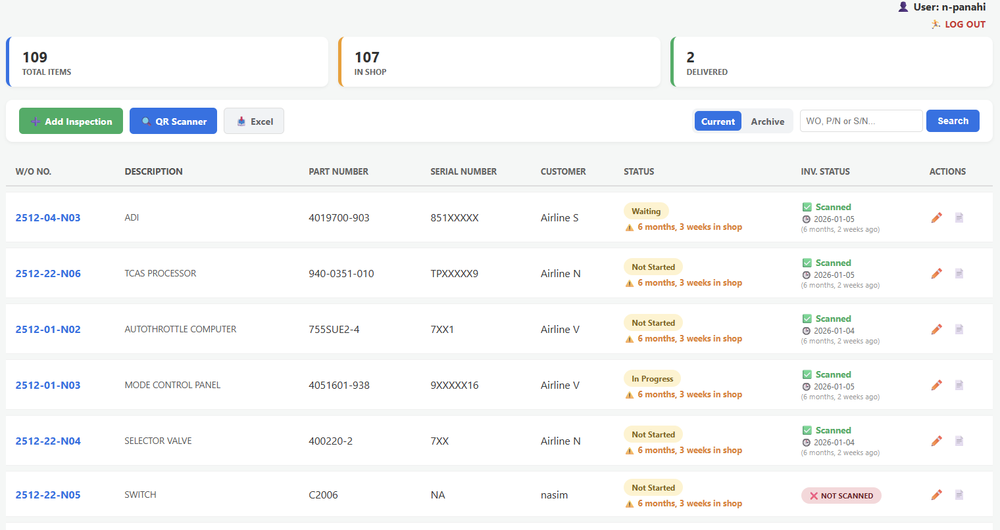

# MRO Inventory Predictive System & Dashboard

This repository contains the source code and replication materials for the Django-based MRO (Maintenance, Repair, and Overhaul) inventory management system and predictive decision-support framework.

---

## 📌 Project Overview
The system optimizes MRO spare-parts inventory, reduces holding costs, and assists maintenance planning using machine learning models integrated with a web dashboard.

Key features include:
* **Predictive Analytics:** ML models for repair estimation and demand forecasting.
* **Inventory Control:** Real-time stock tracking and QR-code integration.
* **Data Import/Export:** Seamless support for external CSV/Excel datasets.

---

## 🛠️ Prerequisites
* **Python:** 3.10 or higher
* **Git**
* **Dependencies:** Listed in `aviation_project_file/requirements.txt`

---

## 🚀 Installation & Quick Start

Follow these steps to replicate the local environment:

### 1. Clone the Repository
```bash
git clone https://github.com/nikipanahi/predictive-system.git
cd predictive-system/aviation_project_file
### 2. Create and Activate Virtual Environment
Windows (PowerShell):
python -m venv venv
.\venv\Scripts\activate
Linux / macOS:
python3 -m venv venv
source venv/bin/activate
python3 -m venv venv
source venv/bin/activate
3. Install Dependencies
pip install -r requirements.txt
4. Apply Database Migrations
python manage.py migrate
python manage.py migrate
5. Run the Local Development Server
python manage.py runserver
Access the application in your browser at: [http://127.0.0.1:8000/](http://127.0.0.1:8000/)

🔑 Demo Credentials (For Peer Review)
To review admin functionality and interactive dashboards:

Admin / Login URL: [http://127.0.0.1:8000/admin/](http://127.0.0.1:8000/admin/)

Username: reviewer

Password: MroAdmin2026!

📂 Project Structure
predictive-system/
└── aviation_project_file/
    ├── mro_app/              # Main Django application (models, views, forms)
    ├── inventory_site/       # Django project configuration & settings
    ├── manage.py             # Django CLI management script
    ├── requirements.txt      # Project dependencies
    └── db.sqlite3            # Pre-populated local database
predictive System using ML
# ✈️ Shop-Floor Predictive Maintenance Strategy (Aviation Logs Text-Mining)

This repository contains a specialized Text-Mining and Machine Learning model that analyzes real-world aviation maintenance logs to predict and classify structural actions on official vs. non-official aircraft parts.

## 📊 Project Output
Here is the operational dashboard of the Django-based MRO platform:


## 🛠️ Tech Stack
- Python 3.x
- Scikit-Learn (DecisionTreeClassifier, TfidfVectorizer)
- Pandas & Matplotlib
